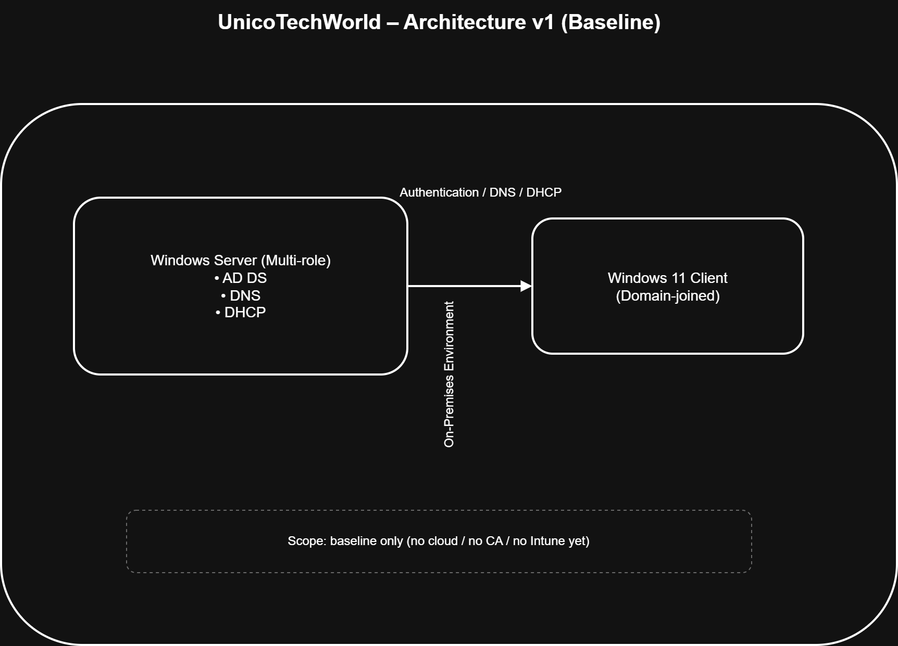
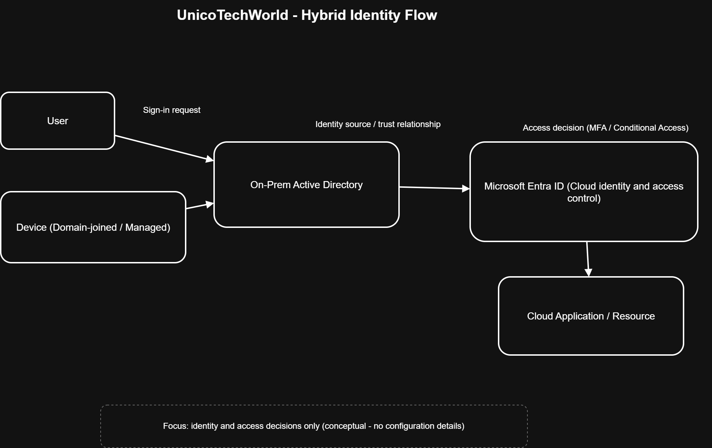

# Architecture Diagrams

This folder contains **high-level architectural diagrams** that visually describe the environment and identity model used in this project.

The purpose of these diagrams is to provide a **conceptual understanding** of the architecture — not technical implementation details.

---

## 🎯 Scope & Intent

The diagrams in this folder focus on:
- The **main components** of the environment (on-premises, cloud, users, devices)
- The **relationships and trust boundaries** between those components
- The **identity and access flow** in a hybrid setup

They are intentionally kept **high-level and technology-agnostic** where possible.

---

## 📂 Diagram Overview

| Diagram | Purpose |
|-------|--------|
| architecture-v1 | Baseline on-prem architecture (Phase 1) |
| hybrid-identity-flow | Conceptual hybrid identity & access flow |

### `architecture-v1.drawio`
**Purpose:**  
Represents the **initial (Phase 1) architecture** of the environment.

**What it shows:**
- A single on-premises Windows Server (multi-role)
- A Windows 11 client
- Core infrastructure roles (AD DS, DNS, DHCP)
- The starting point of the hybrid identity journey

**Notes:**
- This is a **baseline architecture**
- The `v1` naming is intentional and allows future evolution

> Source file: `architecture-v1.drawio`

---

### `hybrid-identity-flow.drawio`
**Purpose:**  
Explains the **identity and access flow** in a hybrid environment.

**What it shows:**
- User and device authentication paths
- On-prem Active Directory
- Microsoft Entra ID
- Access decision points (e.g. MFA, Conditional Access)

**Focus:**
- *What* identity decisions happen
- *Where* those decisions occur  
- Not *how* they are configured

> Source file: `hybrid-identity-flow.drawio`

---

## 🚫 Explicitly Out of Scope

The following elements are **not** included in these diagrams:
- IP addresses
- Network ports
- Configuration settings
- Installation steps
- Troubleshooting details
- Screenshots

These topics are documented in other parts of the repository.

---

## 🧠 How to Read These Diagrams

Think of these diagrams as:
> “The mental model of the environment”

They are meant to answer:
- *How is everything connected?*
- *Which systems are involved?*
- *Where do identity and access decisions happen?*

Not:
- *Which checkbox was enabled?*
- *Which command was used?*

---

